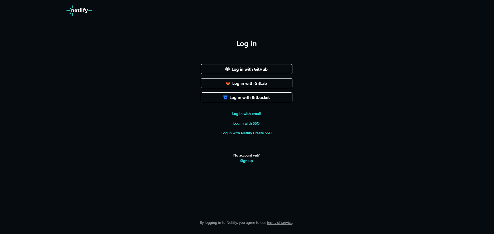
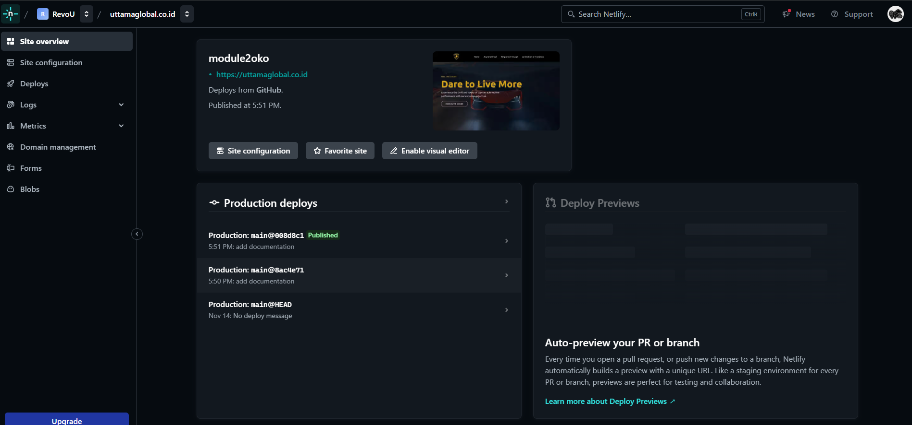
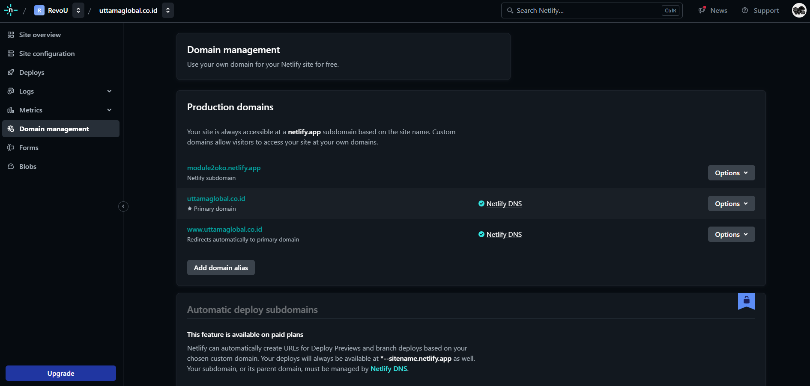
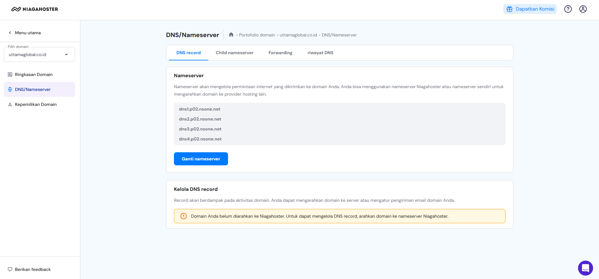

# Assignment Objective Website

This is a simple and responsive website built with HTML, CSS and Tailwind. 


## Features

- Responsive design for various screen sizes.
- Asymetrical Grid
- Animation and Transition
- Responsive image

## Technologies Used

- HTML5
- CSS
- Tailwind

## Setup

1. Clone the repository:
    ```bash
    git clone https://github.com/revou-fsse-oct24/module-2-thegoner24.git
    ```
2. Navigate to the project directory:
    ```bash
    cd module-2-thegoner24
    ```
3. Open the `index.html` file in your browser:
    ```bash
    open index.html
    ```


## Code 

In this case i use @keyframes to trigger bounce animation.

> Example

    @keyframes bounce-animation {<br>
        0%, 100% { transform: translateY(0); }<br>
        50% { transform: translateY(-20px); }<br>
    }<br>
    .animate-bounce-animation {<br>
        animation: bounce-animation 1s infinite;<br>
    }


# Deploying Your Website on Netlify

This guide will walk you through the process of deploying your website on Netlify, from signing up to connecting a custom domain.

---

## Prerequisites

- A GitHub account with your project repository ready.
- A custom domain name.

---

## Step 1: Sign Up on Netlify


1. Go to [Netlify's website](https://www.netlify.com/).
2. Click on **Sign Up** in the top-right corner.
3. Sign up using your **GitHub account** or any other preferred method.
4. Authorize Netlify to access your GitHub repositories.

---

## Step 2: Connect Your GitHub Repository


1. Once logged in, click on **Add New Site** or **New Site from Git**.
2. Select **GitHub** as your Git provider.
3. Authorize Netlify to access your GitHub account.
4. Search for the repository containing your website's code and click **Select**.
5. Click **Deploy Site** to start the deployment process.

---

## Step 3: Enable Auto Deployment

Netlify automatically enables auto deployment after linking your GitHub repository. Any changes you push to the repository will trigger an automatic build and deployment.

---

## Step 4: Connect a Custom Domain 


1. In your site dashboard, go to the **Domain settings** section. 
2. Click **Add Custom Domain**. In this case i'm using **Niagahoster**.
3. Enter your custom domain name and click **Verify**.
4. Update your domain's DNS settings:
   - Alternatively, use the DNS settings provided by Netlify.

5. Wait for DNS propagation (usually a few minutes to a few hours).
6. Once verified, your custom domain will be live!


## Full Deployment

You Can Check [Here!](https://uttamaglobal.co.id/)